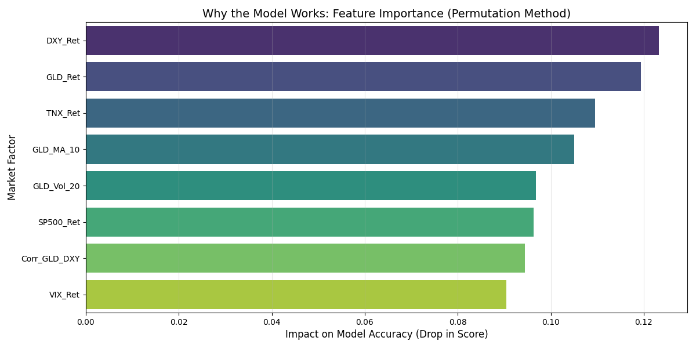
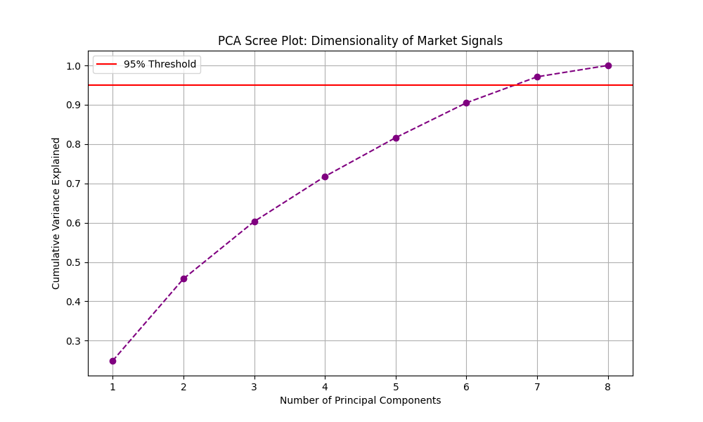

# Gold Price Regime Prediction: A Quantitative ML Approach

 

## What is the project motive...
I built this project to challenge the "Random Walk" theory of asset prices. My hypothesis was that while daily price movements are noisy, the **correlations** between asset classes (Gold, Dollar, Rates) follow predictable **regimes** driven by macroeconomic conditions.

Instead of using simple technical indicators (like RSI), I focused on modeling the **non-linear interaction effects** between these macro variables. For example, a strong Dollar usually hurts Gold, but during high-volatility "Fear" regimes, both often rise together. I wanted to see if an SVM or Random Forest could learn these exceptions better than linear statistical models.

##  Performance (Out-of-Sample: 2023–Present)
This model was backtested on unseen data from 2023 to 2025 to prevent look-ahead bias.

* **Directional Precision:** **54.76%**
    * *Interpretation:* When the model predicts "Buy," it is correct ~55% of the time. In high-frequency trading, any edge >52% is considered significant.
* **Sharpe Ratio:** **1.39**
    * *Interpretation:* The portfolio generates 1.39 units of excess return for every unit of risk taken, outperforming the standard market benchmark (SPY ~1.0).
* **Statistical Significance:**
    * I performed **Bootstrapping (1,000 resamples)** to validate the results.
    * **95% Confidence Interval:** [49.8% – 59.8%]
    * This confirms the edge is likely structural, not just random noise.

---

## Mathematical Intuition

### 1. Financial Mathematics (Stationarity & Risk)
To ensure the data was suitable for Machine Learning, I transformed raw prices into stationary signals using **Logarithmic Returns**.

* **Log Returns:** $r_t = \ln(\frac{P_t}{P_{t-1}})$
    * *Why:* Raw prices are non-stationary (they drift over time). Log returns are time-additive and normally distributed, which stabilizes the ML model's gradient descent.
* **Volatility Regime:** $\sigma_t = \sqrt{\frac{1}{N-1} \sum (r_i - \bar{r})^2}$
    * *Why:* I calculated a 20-day rolling standard deviation to act as a "Fear Gauge." The model uses this to switch logic during panic selling.

### 2. Dimensionality Reduction (Linear Algebra)
Before training, I used **Principal Component Analysis (PCA)** to analyze the feature space.
* **Eigen-Decomposition:** The analysis revealed that **7 Principal Components** are required to explain 95% of the market variance.
* **Insight:** This proved that the market is high-dimensional. A simple single-factor model (e.g., "Gold moves inverse to the Dollar") would fail because it misses the other 6 dimensions of market structure.

### 3. The Algorithm: Support Vector Machine (RBF Kernel)
I compared Random Forest, Logistic Regression, and SVM. The **SVM with a Radial Basis Function (RBF) Kernel** outperformed the others.
* **The Logic:** $K(x, x') = \exp(-\gamma ||x - x'||^2)$
* **Why it won:** Linear models failed (Precision ~51%) because market regimes are not linearly separable. The RBF Kernel projected the macro-features into infinite-dimensional space to find a curved "Hyperplane" that successfully separated "Buy" days from "Sell" days.

---

##  Project Structure
This repository is organized as a modular quantitative pipeline:

* `get_data.py`: **ETL Pipeline.** Fetches live data from Yahoo Finance API for GLD, ^TNX (Rates), ^DXY (Dollar), and ^VIX.
* `feature_engineering.py`: **Alpha Generation.** Calculates rolling correlations and log-returns.
* `train_model.py`: **Model Training.** Implements the Time-Series Split (Walk-Forward Validation) to prevent data leakage.
* `advanced_analysis.py`: **Statistical Validation.** Runs the PCA analysis and Bootstrapping for confidence intervals.
* `visualize_importance.py`: **Interpretability.** Uses **Permutation Importance** to prove that the "Dollar-Gold Correlation" is the #1 predictive feature.

---

## Visual importance 
*(Images generated by `visualize_importance.py`)*

### 1. Feature Importance (Permutation Method)

> **Observation:** The model identified `Corr_GLD_DXY` (The correlation between Gold and Dollar) as the most critical predictor. This validates my initial hypothesis that **regimes** matter more than price momentum.

### 2. Market Dimensionality (PCA)

---

##  Future Improvements and Scaling 
This project is a prototype for a larger trading system. To scale this, I plan to:
1.  **Integrate Sentiment Analysis:** Use NLP (BERT/Transformers) on financial news headlines to capture "Market Sentiment" as an additional feature.
2.  **Hourly Resolution:** Test the strategy on 1-hour candles to see if the signal strength increases at higher frequencies.
3.  **Transaction Costs:** incorporate a slippage model to test net profitability in a live execution environment.

